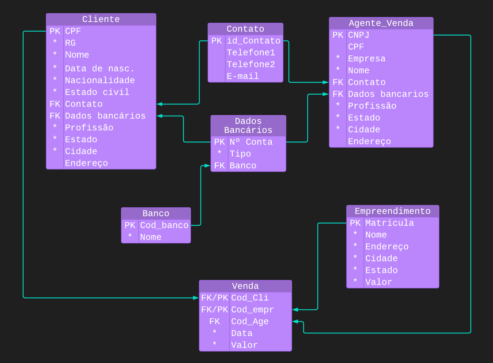

# Desafio DB_SQL
Geração de contrato de venda em um arquivo txt. Esse desafio foi proposto durante meu estágio para colocar em práticas as lógica de busca de dados de um banco de dados relacional e a geração de um arquivo em txt com os dados de um cliente ficticio.

## Por que esse repositório está Público?
Recomendo a todos que estão ainda no começo de sua trajetória se aprofundar o máximo possível nos fundamentos de lógica de programação, pois será sua base em tudo que fará na sua jornada de programação. Por esse motivo mantenho todos os meus repositórios de estudo abertos para quem quiser utilizar como base em seus estudos.

## Lembre-se:
Saber a linguagem não é tão importante quanto saber como usá-la para resolver problemas.

## Diagrama do desafio

### Criado com requisitos:
- Python 3.9.5
- Principais pacotes Python: Shutil, Pyodbc
- Server: Google Cloud Platform - SQL
- Database: SQL Server
